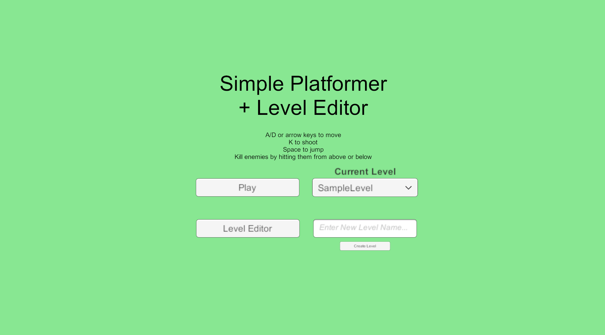
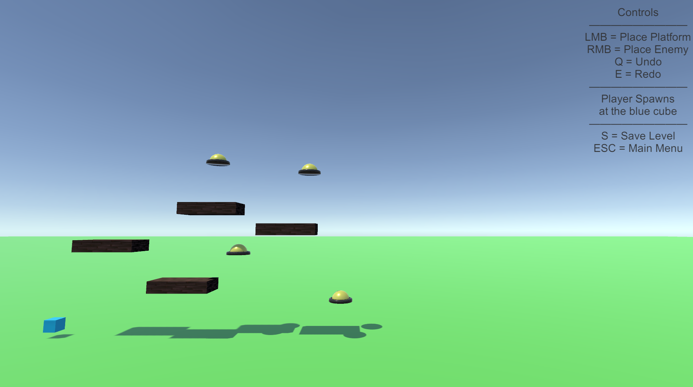
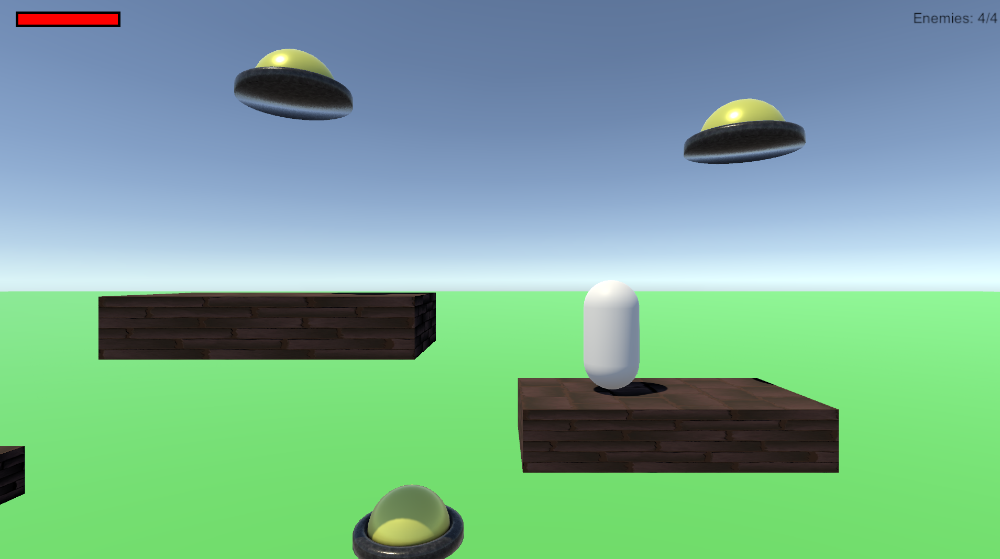
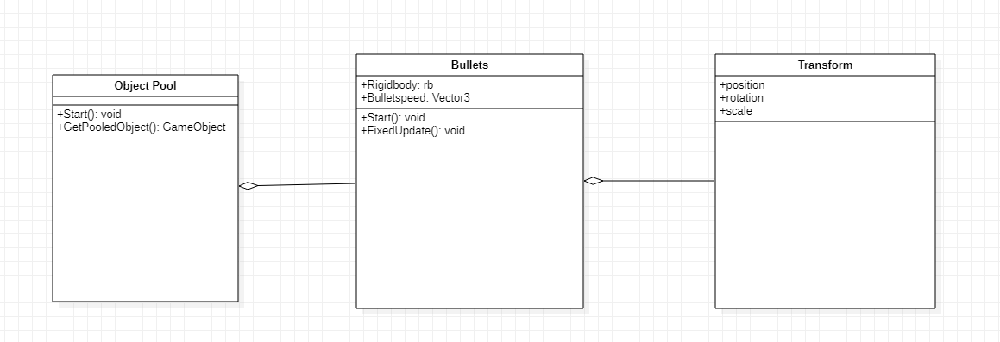

# INFR 3310U - Game Engine Design And Implementation Assingment 3

###Level Editor - By Alvin Ng (100754129)

###Project Started based on Assignment 2

###Game Description

Platformer where the player jumps on platforms to reach enemies and defeat them by jumping above or below them. 
Players can shoot bullets and enemies will move back and forth.
Players can use the level editor to make their own levels.

### Screenshots

### Demo Video
Youtube link: [https://youtu.be/ST56l9qecFM](https://youtu.be/ST56l9qecFM "Youtube")

### UML Diagram

### Third-Party acknowledgement

No Third-Part art or sound assets were used
Platform and Enemy models were made using blender and substance designer

Code was used based on in class tutorials and websites
Object Pooling: [https://learn.unity.com/tutorial/introduction-to-object-pooling]

